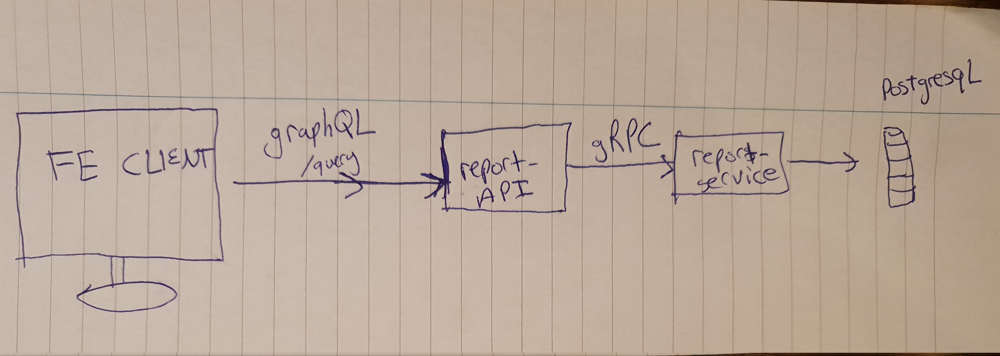

# Instructions

In this document I explain at a high-level my understanding of 'Q Main', how I set out to achieve this task, how I have achieved it and I give a brief overview of each service built.

---

## Q Main

Build a prototype of the first two tabs.

---

### Table of Contents

**[Architecture of the project](#Architecture-of-the-project)**<br>
**[Answers to remaining questions](#Answers-to-remaining-questions)**<br>

<!-- **[Troubleshooting](#troubleshooting)**<br>
**[Compatibility](#compatibility)**<br>
**[Notes and Miscellaneous](#notes-and-miscellaneous)**<br>
**[Building the Extension Bundles](#building-the-extension-bundles)**<br>
**[Next Steps, Credits, Feedback, License](#next-steps)**<br> -->

## Architecture of the project

The entire project follows the structure as shown in the diagram below:



The front-end consists of two pages, the first page (Create a report) has 5 tabs and is the prototype I was asked to build. Each tab has its own URL, this makes it easier for users to share their tabs with their colleagues/customers etc. Clicking the complete button will execute a graphQL mutation, and can only be clicked when the progress of the report, in this case only the completion of the first two tabs will define the buttons "completeness". Reset button will reset the progress of the current tab only (reseting some antd components isn't straightforward).

The second page (View-reports) queries the back-end to get all the reports in a postgreSQL database. If the connection failed, the front-end will display two hardcoded lists as shown below.

## My understanding of Q main

There was two save buttons on the page, I wasn't sure what the expected behaviours of both save buttons were meant to be. Does the bottom save save to local state? Save to the backend? Save only current tab or all tabs? Does the top save behave the same/different? I have therefore disabled all buttons that dont have functionality attached to their handlers (Cancel and Save).

The complete button should only appear when all the progress of all tabs is 100%, once clicked, it should create an entry in a postgreSQL database by going through two services. One should be the exposed layer (report-api) (exposing a graphQL endpoint) which would then communicate (gRPC) with a private service (report-service)

## What has been done in Q Main:

I have set out to build a basic system that can take input from the user, and create an entry to a postgres database. This is achieved by following the data flow as shown in the following diagram. Once all the progress in each of the tabs is complete, the 'complete' button in the top right corner will appear and if clicked, will create a GraphQL mutation creating a new instance of a Report. It does this by first posting to the `report-API`. This would be the API that is exposed to the world and can get queried via `localhost:8080/query`. The `report-API` is essentially proxying the `report-service` via gRPC, which is not be exposed to the world. The `report-service` will then create an entry with the data in a postgreSQL database.

On the front-end, there is also a path (localhost:3000/view-reports), which queries the database for all the entries added as shown in the diagram below.

## Why I have done it

Part of the responsiblities provided by your spec is:

- Fast delivery of prototype UI to prove and demo potential solutions to users and clients
- Creation of modular web-based React apps targeted to specific user groups Ownership of UI design and look-and-feel consistency aligned to the corporate brand
- Creation of backend APIs to support the frontend apps Management

---

The reason why I chose the library antd for components was because it easy to whitelabel a product, essentially changing the look-and-feel consistency to align to a corporate branch.

I have created the backend APIs to support my frontend products and quickly delivered a prototype UI.

---

# Answers to remaining questions

Q1 was missing from the original README.

## Q0.

1000 kg of berries are initially found to be 99% water.
After a week, due to evaporation, the berries are 98% water.
What is the mass of the berries now?

A: 500kg.
99% of water means 990kg is water making 10kg berry.
10kg is equal to 2% of the total mass, therefore, 100% of the total mass is 10\*50=500.

## Q2.

A text file contains a list of numbers, one per line.
Write a shell pipeline (i.e. a bash one-liner) which will print out the five most commonly occurring numbers, one per line, without surrounding whitespace, in descending order of frequency.
Use of perl, awk, or any other programming language should be avoided.

A: `cat unsorted.txt | grep -Eo '[[:alnum:]]+' | sort | uniq -c | sort -r | head -5 | cut -c9-`

Adding `| od -a` will confirm no surrounding whitespace.

## Q5.

A videoconferencing application, running on a mobile device, is
consuming 80% CPU, and causing the battery to drain rapidly. What
steps might you take to improve battery life?

A: Factors that impact battery life through a videoconferencing application:

- Resolutions od the video (the higher the resolutions the more the consumption).
- The comms protocol, assuming you are using 2.45 wifi, the battery consumption will also be very high for streaming and processing the Video.
- The application used for viewing . It depends on how well it has been written and if your hardware is the best configuration for it.

## Q9.

Calculator for mobile.

A: I have initially implemented this using progressive web apps (new for me), but I couldn't finish it so I will omit from posting incomplete code.

## Q10.

- If the number is divisible by 3, or contains a digit 3,
  print "Fizz" instead of the number.
- Similarly, for 5s, print "Buzz".
- If both the "3" and "5" conditions, "Fizz Buzz".

A:

```
#!/bin/node

for up to 100, only two occurrences will contain both digits 3 and 5
for (let ii=0; ii< 101 ; ++ii){
    case(ii % 15 === 0 || String(ii).indexOf('35') !== -1 || String(ii).indexOf('53') !== -1):
      console.log("FizzBuzz");
      break;
    case(ii % 3 === 0 || String(ii).indexOf('3') !== -1):
      console.log("Fizz");
      break;
    case(ii % 5 === 0 || String(ii).indexOf('5') !== -1 ):
      console.log("Buzz");
      break;
    default:
      console.log(ii)
  }
}
```

## Q11.

Stock within a warehouse is represented by rows in the following
database table:

CREATE TABLE stock (
id SERIAL,
product_id integer NOT NULL REFERENCES products ( id ),
location_id integer NOT NULL REFERENCES locations ( id ),
package_id integer REFERENCES packages ( id ),
qty integer
);

Any products that are within the same package, given the constraints of physics, must be present at the same location within the
warehouse. Unfortunately, due to bugs in the application layer, some database rows violate this constraint.

There are approximately two million rows in the stock table.

Write a database query to identify the affected rows.

A: `select * from stock where (product_id, package_id) in ( select product_id, package_id from stock group by product_id, package_id having count(location_id) > 1) order by product_id, package_id, location_id;`

## Q14 & Q15

As I have implemented a backend as well I saw these two questions as redundant even though they differ in implementation from my backend.
